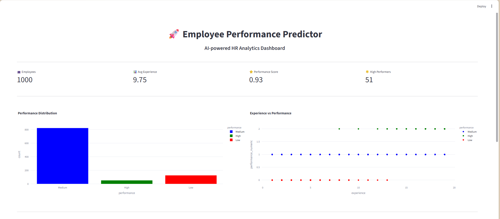
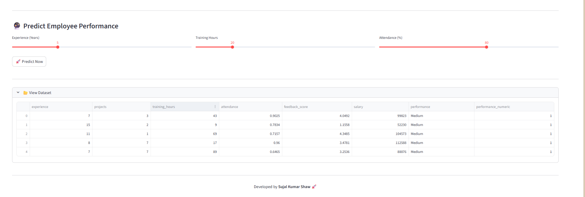

# 🚀 Employee Performance Predictor using Data Analytics

### 👨‍💻 Author: **Sujal Kumar Shaw**

---

## 📌 Project Overview

The **Employee Performance Predictor** is an end-to-end machine learning project designed to analyze employee data and predict future performance levels (High / Medium / Low).

This system simulates a real-world **HR analytics workflow** used by modern organizations to make data-driven decisions regarding employee growth, training, and retention.

---

## 🎯 Problem Statement

Organizations often struggle to:

* Identify high-performing employees
* Detect low performers early
* Optimize training investments
* Make unbiased promotion decisions

This project solves these challenges using **data analytics + machine learning**.

---

## 💡 Business Value

✔ Helps HR teams make smarter decisions
✔ Reduces bias in performance evaluation
✔ Improves employee productivity
✔ Enables targeted training & development

---

## 🧠 Tech Stack

* Python 🐍
* Pandas, NumPy
* Scikit-learn
* XGBoost
* Plotly
* Streamlit

---

## 🏗️ Project Architecture

```
Data → Preprocessing → EDA → Feature Engineering → Model → Prediction → Dashboard
```

---

## 📂 Folder Structure

```
Employee-Performance-Predictor/
│
├── app/                # Streamlit dashboard
├── data/               # Dataset
├── models/             # Saved ML model
├── src/                # Core logic (EDA, training)
├── outputs/            # Graphs & results
│   └── screenshots/    # Project screenshots
├── README.md
├── requirements.txt
└── main.py
```

---

## ⚙️ Features

* 📊 Data Analysis (EDA)
* 🤖 ML Model (XGBoost)
* 📈 Performance Prediction
* 🎯 KPI Dashboard
* 📉 Visualization (Plotly)
* 🧠 HR Decision Insights

---

## 🔮 Prediction Output

The model predicts:

* 🌟 High Performer
* ⚡ Medium Performer
* ⚠️ Low Performer

---

# 📸 Project Screenshots

### 🚀 Full Dashboard



---

### 🤖 Prediction Result (High / Medium / Low)



---

### 📊 Charts & Insights


---

### 📂 Dataset Preview


---

## ▶️ How to Run

```bash
git clone https://github.com/sujalkrshaw/employee-performance-predictor.git
cd Employee-Performance-Predictor

pip install -r requirements.txt

streamlit run app/app.py
```

---

## 📊 Results

* Model trained on synthetic HR dataset
* Achieved strong classification performance
* Successfully predicts employee performance levels

---

## 🚀 Future Improvements

* Real HR dataset integration
* SHAP explainability
* Deployment (Cloud)
* Employee attrition prediction

---

## 🧑‍💼 Industry Relevance

Used in companies like:

* Google
* Amazon
* TCS
* Accenture

for HR analytics & decision-making.

---

## ⭐ Conclusion

This project demonstrates how **data science can transform HR decision-making** using predictive analytics.

---

## 🙌 Acknowledgment

Special thanks to **Umesh Yadav Sir** for guidance and inspiration.

---

## ⭐ Support

If you found this project useful, consider giving it a ⭐ on GitHub!
