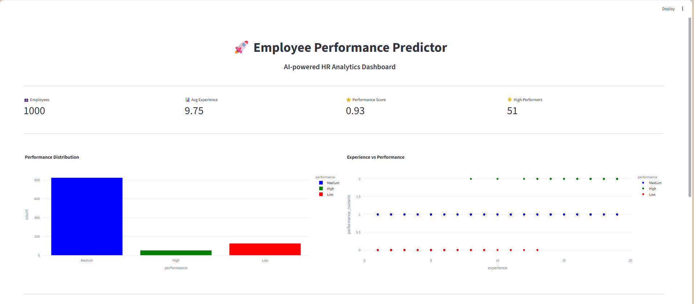
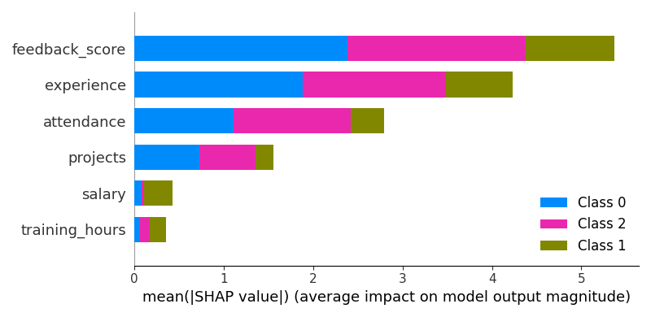

# 🚀 Employee Performance Predictor & HR Analytics Dashboard

<p align="center">
  
  
  
  
  
</p>

<h1 align="center">👨‍💼 Employee Performance Predictor</h1>

<p align="center">
📊 AI-Powered HR Analytics, Employee Performance Prediction & Workforce Intelligence System
</p>

---

# 🌐 Live Demo

## 🚀 Open Live Dashboard

👉 https://employee-performance-predictor.streamlit.app/

---

# 🖥 Dashboard Preview

<p align="center">
  
</p>

---

# 📌 Project Overview

The Employee Performance Predictor is a Machine Learning and HR Analytics project developed using Python, Streamlit, Scikit-learn, and interactive visualization tools.

This project analyzes employee-related factors and predicts employee performance using AI-powered analytics and predictive modeling techniques.

The system simulates intelligent HR systems used in modern enterprises for:

- 👨‍💼 Workforce Analytics
- 📈 Employee Performance Evaluation
- 🤖 HR Intelligence
- 📊 Productivity Monitoring
- 🧠 AI-driven HR Insights

The dashboard transforms raw employee data into meaningful insights and predictive HR analytics.

---

# ❗ Problem Statement

Traditional employee evaluation methods are:

- ⏳ Time-consuming
- 📉 Subjective
- 📊 Difficult to scale
- ❌ Unable to predict future performance

Organizations need intelligent systems capable of:

✅ Predicting employee performance  
✅ Detecting productivity patterns  
✅ Identifying high performers  
✅ Supporting HR decision-making  

This project solves these challenges using Data Science and Machine Learning.

---

# 🎯 Project Objectives

✅ Analyze employee performance data  
✅ Predict employee performance using AI  
✅ Visualize workforce analytics  
✅ Generate HR insights  
✅ Build an interactive dashboard  
✅ Support intelligent HR decisions  

---

# 🧠 AI Features

The dashboard includes advanced AI-powered HR analytics features:

- 🔮 Employee Performance Prediction
- 📊 Workforce Analytics
- 📈 Employee Trend Analysis
- 🤖 Machine Learning Classification
- 📉 Productivity Insights
- 🌟 High Performer Identification
- 🧠 SHAP Explainability Analysis

---

# ⚙️ System Architecture

```text
Employee Dataset
        ↓
Data Cleaning & Preprocessing
        ↓
Feature Engineering
        ↓
Machine Learning Model
        ↓
Performance Prediction
        ↓
Visualization Dashboard
        ↓
HR Insights & Analytics
```

---

# 🧪 Dataset Features

The dataset includes:

- Employee Experience
- Training Hours
- Attendance
- Salary
- Project Count
- Feedback Score
- Performance Label

---

# 🤖 Machine Learning Pipeline

## 📌 Workflow

```text
Raw HR Data
      ↓
Preprocessing
      ↓
Feature Engineering
      ↓
Model Training
      ↓
Prediction
      ↓
SHAP Explainability
      ↓
Dashboard Visualization
```

---

# 🧠 ML Model Information

| Component | Description |
|---|---|
| Problem Type | Classification |
| Model | Random Forest / ML Classifier |
| Input | Employee Features |
| Output | Performance Prediction |
| Explainability | SHAP Analysis |

---

# 📊 Dashboard Features

# 📌 KPI Cards

The dashboard displays:

- 👥 Total Employees
- 📈 Average Performance
- 🌟 High Performers
- 📊 Average Experience

---

# 📊 Interactive Visualizations

### 📈 Performance Distribution

Analyzes overall employee performance categories.

---

### 👨‍💼 Experience vs Performance

Visualizes relationship between experience and productivity.

---

### 📊 Attendance Analysis

Tracks attendance impact on performance.

---

### 📉 Salary vs Performance

Analyzes compensation and productivity relationship.

---

### 🔮 AI Prediction Panel

Predicts employee performance based on:

- Experience
- Attendance
- Training Hours
- Feedback Score

---

# 🧠 Explainable AI (SHAP)

The project uses SHAP Explainability to understand model decisions.

### 📌 SHAP Benefits

✅ Feature importance analysis  
✅ Transparent predictions  
✅ HR interpretability  
✅ AI explainability  

---

# 📸 Dashboard Screenshots

# 🖥 Main Dashboard

<p align="center">
  
</p>

---

# 🧠 SHAP Explainability Analysis

<p align="center">
  
</p>

---

# ⚙️ Technologies Used

| Technology | Purpose |
|---|---|
| Python | Core Programming |
| Pandas | Data Analysis |
| NumPy | Numerical Computing |
| Streamlit | Dashboard Development |
| Plotly | Interactive Charts |
| Matplotlib | Visualization |
| Scikit-learn | Machine Learning |
| SHAP | Explainable AI |
| Joblib | Model Saving |
| GitHub | Version Control |
| Streamlit Cloud | Deployment |

---

# 📂 Project Structure

```text
employee-performance-predictor/
│
├── app/
│   └── app.py
│
├── data/
│   └── employee_data.csv
│
├── models/
│   └── model.pkl
│
├── outputs/
│   └── screenshots/
│       ├── dashboard.png
│       └── shap_summary.png
│
├── src/
│
├── requirements.txt
└── README.md
```

---

# 🚀 Installation Guide

## 1️⃣ Clone Repository

```bash
git clone https://github.com/sujalkrshaw/employee-performance-predictor.git
```

---

## 2️⃣ Open Project Folder

```bash
cd employee-performance-predictor
```

---

## 3️⃣ Create Virtual Environment

```bash
python -m venv venv
venv\Scripts\activate
```

---

## 4️⃣ Install Dependencies

```bash
pip install -r requirements.txt
```

---

## 5️⃣ Run Application

```bash
streamlit run app/app.py
```

---

# 🌐 Deployment

This project is deployed using Streamlit Community Cloud.

## 🚀 Live Website

https://employee-performance-predictor.streamlit.app/

---

# 📈 Real-World Applications

Applicable in:

- 👨‍💼 HR Analytics
- 📊 Workforce Intelligence
- 🤖 AI Recruitment Systems
- 📈 Employee Productivity Analysis
- 🏢 Enterprise HR Platforms

---

# 🚀 Future Improvements

🔹 Deep Learning-based Prediction  
🔹 Employee Attrition Prediction  
🔹 Real-time HR Analytics  
🔹 Cloud Database Integration  
🔹 Role-based Performance Analysis  
🔹 AI HR Assistant  

---

# 💡 Learning Outcomes

Through this project, I learned:

✅ Machine Learning Classification  
✅ HR Analytics Workflow  
✅ Streamlit Dashboard Development  
✅ SHAP Explainability  
✅ Feature Engineering  
✅ Data Visualization  
✅ End-to-End ML Deployment  

---

# 👨‍💻 Author

## Sujal Kumar Shaw

🎓 B.Tech Student | Aspiring Data Scientist

### 🚀 Interests

- 🤖 Artificial Intelligence
- 📊 Data Science
- 👨‍💼 HR Analytics
- 📈 Machine Learning

---

# 🔗 Project Links

## 🌐 Live Demo

https://employee-performance-predictor.streamlit.app/


---

# ⭐ Support

If you liked this project:

⭐ Star this repository  
🍴 Fork the project  
📢 Share the project  

---

# 📜 License

This project is developed for educational and portfolio purposes.

---

# 🚀 Final Note

This project demonstrates how Artificial Intelligence, Machine Learning, Explainable AI, and Interactive Visualization can be combined to build intelligent HR analytics systems capable of predicting employee performance and generating workforce insights.
